### Hi there~ 👋

Welcome to my page! I'm Kaibo Tang. 

I am currently a visiting student at the [Advanced MR Acquisition Lab](https://mriacq-lab.martinos.org/) at the [Athinoula A. Martinos Center for Biomedical Imaging](https://www.martinos.org/) at Massachusetts General Hospital. 

I obtained my B.S.P.H in Biostatistics and B.S. in Mathematics with a minor in Chemistry from UNC Chapel Hill in 2025. During my time at UNC Chapel Hill, I worked as a research assistant at the [UNC BRAIN Lab](https://bbm.web.unc.edu/) at the [Biomedical Research Imaging Center (BRIC)](https://www.med.unc.edu/bric/) at UNC Chapel Hill. 

During my free time, I contribute to:

Feel free to check out [my homepage](https://kvttt.github.io/) and my [Curriculum Vitae](https://kvttt.github.io/files/Kaibo_Tang_CV.pdf).
