### Hi there~ 👋

Welcome to my page! I'm Kaibo Tang. 

I am a first-year PhD student in the [Department of Electrical and Computer Engineering](https://www.bu.edu/eng/academics/departments-and-divisions/electrical-and-computer-engineering/) at Boston University, working with Drs. Fuyixue Wang and Zijing Dong at the [Advanced MRI Acquisition Lab](https://mriacq-lab.martinos.org) at the [Athinoula A. Martinos Center for Biomedical Imaging](https://www.martinos.org) at Massachusetts General Hospital and Harvard Medical School, where I first joined as a visiting student in March 2024.
My research focuses on developing deep learning reconstruction and accelerated acquisition methods to achieve fast and robust mesoscale diffusion MRI in vivo.

Prior to joining Boston University, I was an undergraduate student at [UNC Chapel Hill](https://www.unc.edu/), where I received a BSPH in Biostatistics, a BS in Mathematics, with a minor in Chemistry.
During my time at UNC Chapel Hill, I worked with Dr. Gang Li at the [UNC BRAIN Lab](https://bbm.web.unc.edu/) in the [Biomedical Research Imaging Center (BRIC)](https://www.med.unc.edu/bric/) since September 2021. 
My research focused on developing infant-dedicated deep learning tools for image registration and constructing volumetric atlases for the early developing brain.

During my free time, I contribute to:

Feel free to check out [my homepage](https://kvttt.github.io/) and my [Curriculum Vitae](https://kvttt.github.io/files/Kaibo_Tang_CV.pdf).
